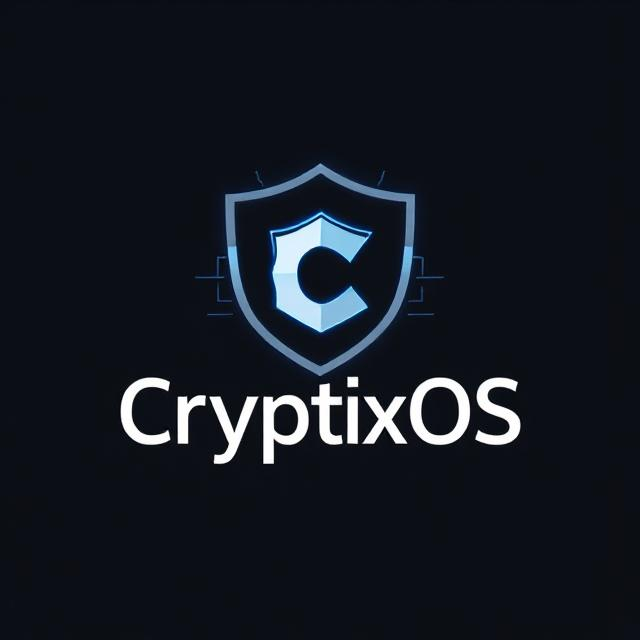
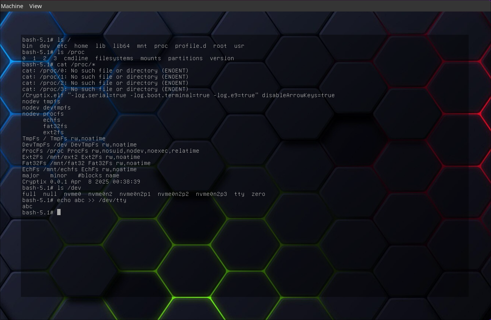

# 🧬 CryptixOS

**CryptixOS** is a modern, modular, Unix-like operating system for `x86_64` and `aarch64`, written entirely in C++. It features its own kernel, standard library (`Prism`), and build system. Designed for clarity, extensibility, and education, CryptixOS serves as a powerful base for learning OS development or building your own custom system from scratch.


[](https://github.com/CryptixOS/CryptixOS/actions/workflows/build-sysroot.yml)
[](https://github.com/CryptixOS/CryptixOS/actions/workflows/build.yml)
[](https://github.com/CryptixOS/CryptixOS/actions/workflows/typos.yml)

<p align="center">
  
</p>

# 🔥 Motivation & Goals
CryptixOS was created out of curiosity and a desire to understand how modern operating systems work—from kernel bootstrapping and memory management to user-facing system calls. The goal is to build a modular, maintainable, and educational operating system from scratch, with clean C++ abstractions, not just C.

This project is ideal for:
* Learning OS design (kernel, memory, file systems, drivers, scheduling, etc.)
* Experimenting with low-level C++ in a systems context
* Building an actual custom OS on real or emulated hardware

# ⚙️ Architecture Overview
CryptixOS is a monolithic kernel designed for the x86_64 architecture. It features:
* Physical & virtual memory manager with paging and kernel heap allocation
* Custom C++ STL-like containers (vector, string, intrusive list, unordered map)
* Virtual filesystem layer with support for ext2 and shmem
* ELF loading and execution for userland programs
* Syscall interface for user-kernel communication
* Multithreading and scheduling with future plans for SMP
* Basic device drivers: PS/2, serial, VGA, RTC, PCI, etc.
* It uses its own standard library (Prism) and custom build tools.

# 🚀 Build & Run Instructions
## 🛠 Prerequisites
Make sure the following tools are installed on your system:
- C++20 compiler (GCC or Clang)
- NASM (for low-level assembly)
- QEMU (or Bochs) for emulation
- Meson + Ninja (build system)
- xbstrap + Python 3 (for sysroot management)
- xorriso (for ISO image creation)

## 📦 Setting Up the Sysroot
Before building the kernel, you need to build the system root (toolchain and base packages). Here's how:
```
mkdir build-sysroot       # Create a directory for the sysroot
cd build-sysroot          # Enter it
xbstrap init ..           # Initialize xbstrap using the main repo
xbstrap install base      # Build and install base packages
```
This step ensures you have the tools and libraries needed for building the OS.

## 🧱 Building the Kernel & Image
Once the sysroot is ready:
```
./Meta/setup.sh <x86_64|aarch64>   # Configure for your target architecture
./Meta/build.sh                    # Build the kernel and generate a bootable .iso
```

## 💻 Running in an Emulator
To run CryptixOS in QEMU:
```
./Meta/run.sh <run_uefi|run_bios>
```
- Use run_uefi to boot via UEFI.
- Use run_bios for BIOS boot (x86_64 only).


---

## ✨ Features

- ✅ Fully custom C++ kernel with standard containers
- ✅ ELF loading and userland support
- ✅ PCI / ACPI / APIC / HPET / NVMe / PS/2
- ✅ Multiple filesystems: ext2, tmpfs, procfs, fat32
- ✅ Basic userland shell
- ✅ Lazy Loading the pages 
- ⏳ Signals, AHCI, and full networking coming soon
- ⏳ Networking
- ⏳ Module support

---

## 📚 References & Credits

### Tools & Docs

- [Meson](https://mesonbuild.com/) - Meson is an open source build system meant to be both extremely fast, and, even more importantly, as user friendly as possible.
- [Limine Boot Protocol](https://github.com/limine-bootloader/limine)
- [OSDev Wiki](https://wiki.osdev.org/Main_Page) – A comprehensive resource for operating system development.
- [mlibc](https://github.com/managarm/mlibc.git) - mlibc is a fully featured C standard library designed with portability in mind.

### Third-Party Projects

- [Limine](https://github.com/limine-bootloader/limine.git) - Modern, advanced, portable, multiprotocol bootloader and boot manager, also used as the reference implementation for the Limine boot protocol.
- [compiler-rt builtins](https://github.com/ilobilo/compiler-rt-builtins.git/) – Low-level runtime library for compiler support.
- [demangler](https://github.com/ilobilo/demangler.git) - C++, Microsoft C++, Rust and DLang name demangler
- [fmt](https://github.com/fmtlib/fmt) – Fast, type-safe formatting library (used instead of stdio or iostreams).
- [libstdcxx-freestanding](https://github.com/ilobilo/libstdcxx-headers.git) - Headers from GCC's libstdc++ that can be used in a freestanding environment.
- [magic_enum](https://github.com/Neargye/magic_enum) - Header-only C++17 library provides static reflection for enums, work with any enum type without any macro or boilerplate code.
- [OVMF binaries](https://retrage.github.io/edk2-nightly/) - Unofficial EDK2 nightly build
- [uACPI](https://github.com/acpica/uacpi) - A portable and easy-to-integrate implementation of the Advanced Configuration and Power Interface (ACPI).

---

# 🤝 Contributing
**CryptixOS** welcomes contributions in the following areas:
* New drivers (network, USB, GPU)
* Scheduler enhancements (preemption, SMP support)
* Filesystem additions (FAT, ISO9660)
* Kernel modules
* Unit tests & test harness
* Documentation (inline + developer guides)

## 🧹 Code Style
* Use PascalCase for types and functions
* Use m_PascalCase for private members
* Follow Prism conventions and RAII principles
* Prefer Ref over raw pointers

## ✅ To-Do Tracker

## 🔌 Drivers

### 🧱 Base
- ✅ Kernel Module Loader

### 💾 Storage
- ✅ NVMe
- ⬜ AHCI
- ⬜ SCSI
- ⬜ Virtio

### ⏱ Timekeeping
- ✅ PIT
- ✅ Local APIC Timer
- ✅ RTC
- ⬜ KVM Clock
- ✅ HPET

### ⚡ IRQ Controllers
- ✅ PIC
- ✅ I/O APIC

### 🧩 Hardware Abstraction & Buses
- ✅ PCI
- ✅ PCIe
- ✅ Device Tree
- ✅ ACPI
- ⬜ USB
- ⬜ Embedded Controller

### 📟 Character Devices
- ✅ TTY
- ⬜ PTY
- ✅ Serial
- ✅ I8042 Controller
- ✅ PS/2 Keyboard
- ✅ PC Speaker
- ⬜ Virtio Console

## 🌐 Network Stack

### 📡 Protocols
- ⬜ ARP
- ⬜ TCP
- ⬜ UDP

### 🔌 Network Interface Cards (NICs)
- ✅ Rtl8139
- ⬜ Virtio NIC

## 📁 Virtual File System

- ⬜ Named Pipes

### 📂 File Systems
- ✅ DevTmpFs
- ✅ Ext2Fs
- ✅ Fat32Fs
- ✅ ProcFs
- ✅ TmpFs
- ✅ Initrd
- ⬜ SysFs
- ⬜ DevPtsFs
- ⬜ Plan9Fs
- ⬜ DevLoopFs
- ⬜ Iso9660Fs
- ⬜ EfiVarsFs

## 🧠 Syscall & Core

- ⬜ Signals
- ⬜ Thread API
- ✅ VFS
- ✅ Session Management
- ⬜ Networking## 📄 License

## 📸 Screenshots / Output


## 📚 License
CryptixOS is licensed under the GPL-3.0. See LICENSE for details.

